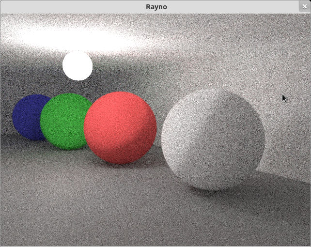
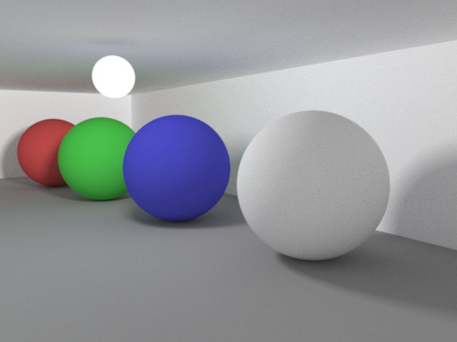
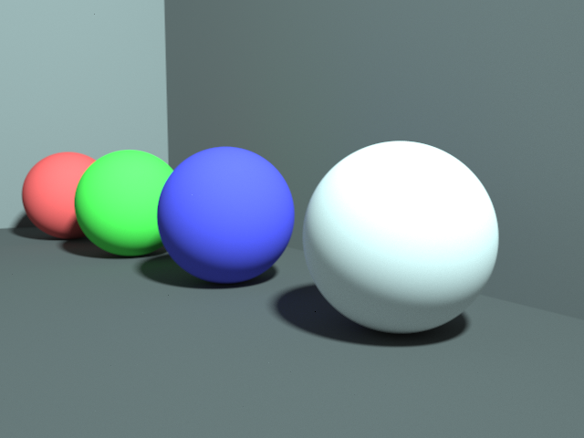
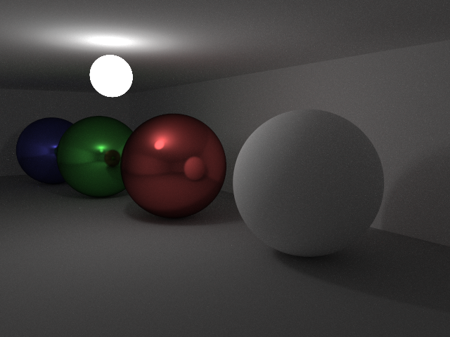
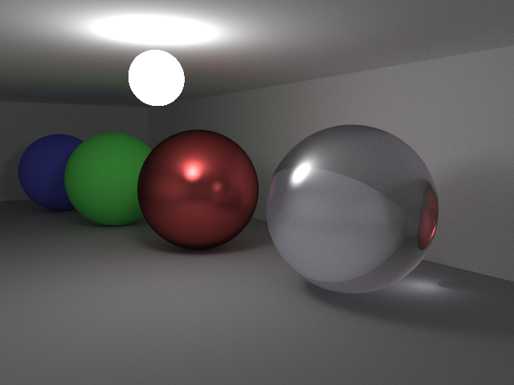
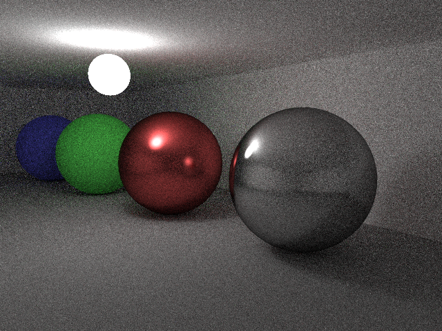
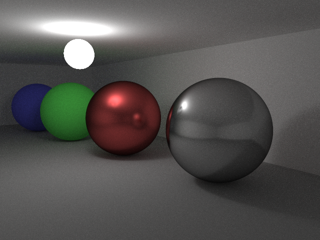

Kajo
====

([Main site](http://www.unrealvoodoo.org/projects/kajo))

Kajo⌘ is a small raytracer that renders images using [multiple importance
sampling](http://graphics.stanford.edu/courses/cs348b-03/papers/veach-chapter9.pdf).
This is a variant of the [Monte Carlo integration
technique](http://en.wikipedia.org/wiki/Monte_Carlo_integration) in which we
compute samples from an integral using several techniques and combine them to
get a better estimate of the actual value. In a raytracer this can help to
reduce computation time and alleviate noise in the final image without
introducing [bias](http://en.wikipedia.org/wiki/Unbiased_rendering).

Kajo currently only supports planes, spheres and spherical lights. There are
two rendering backends:

  - C++ multithreaded CPU renderer
  - OpenGL (GLSL version 1.20) renderer

Kajo is licensed under the [MIT open source license](http://opensource.org/licenses/MIT).

⌘ "kajo" means a glimmer of light in Finnish.

Sample images
-------------

Traditional Monte Carlo

Multiple importance sampling #1

Multiple importance sampling #2

Phong lighting

Caustics

No explicit lighting

Explicit lighting

[More images](http://www.unrealvoodoo.org/projects/kajo)

Compiling
---------

1. Install dependencies, e.g., on Ubuntu/Debian:

  `apt-get install cmake libsdl1.2-dev libsdl-ttf2.0-dev libglew-dev`

2. Check out a copy of the source code:

  `git clone https://github.com/skyostil/kajo.git`

3. Prepare the build files with cmake:

  `mkdir kajo/build; cd kajo/build; cmake ..`

4. Compile:

   `make`

Running
-------

In the build directory:

  `renderer/renderer ../data/spheres.json`

Using the OpenGL renderer:

  `renderer/renderer -r gl ../data/spheres.json`

References
----------

Reading material:

- [Eric Veach, Ph.D. dissertation, Stanford University, December 1997](http://graphics.stanford.edu/papers/veach_thesis/)
- [Mathematical Models and Monte Carlo Algorithms for Physically Based Rendering. Eric Lafortune, February 1996](http://www.graphics.cornell.edu/~eric/thesis/)
- [CS 294-13, Advanced Computer Graphics, Profs. Ravi Ramamoorthi and James O'Brien](http://inst.eecs.berkeley.edu/~cs294-13/fa09/)
- [Bidirectional Path Tracing, Mikkel Adamsen, July 2009](http://www.maw.dk/?page_id=78)
- [Compact Metallic Reflectance Models, László Neumann, Attila Neumann, László Szirmay-Kalos, 1999](http://sirkan.iit.bme.hu/~szirmay/brdf6.pdf)
- [Monte Carlo Ray Tracing, Siggraph 2003 Course 44, Henrik Wann Jensen
](http://www.cs.odu.edu/~yaohang/cs714814/Assg/raytracing.pdf)
- [Global Illumination Compendium, Philip Dutré](http://people.cs.kuleuven.be/~philip.dutre/GI/)
- [The Direct Lighting Computation in Global Illumination Methods, Changyaw Wang](http://www0.cs.ucl.ac.uk/research/vr/Projects/VLF/vlfpapers/monte-carlo/wang__the_direct_lighting_computation_in_GI__phd.pdf)
- [CS 563 Advanced Topics in Computer Graphics Sampling Techniques, Wadii Bellamine](http://web.cs.wpi.edu/~emmanuel/courses/cs563/S07/talks/alex_white_wk11_pt1.pdf)
- [An Introduction to BRDF-Based Lighting, Chris Wynn](http://www.cs.princeton.edu/courses/archive/fall06/cos526/tmp/wynn.pdf)

Libraries used:
- [GLM](http://glm.g-truc.net/0.9.5/index.html) OpenGL mathematics library
- [LodePNG](http://lodev.org/lodepng/) PNG image codec
- [simplejson](https://github.com/simplejson/simplejson) JSON parser
